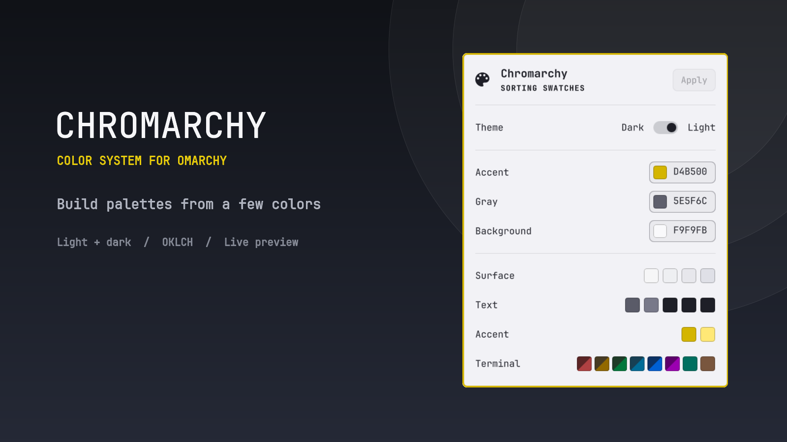

# Chromarchy

Design and apply an Omarchy color palette from a compact topbar popup.



## Features

- separate dark and light palettes;
- `Accent`, `Gray`, and `Background` color controls;
- coordinated interface and terminal colors;
- live preview before applying;
- draft revert and one-step undo.

## Install

```sh
omarchy plugin add https://github.com/unutranyholas/chromarchy --enable
```

Requires Omarchy Quattro. Chromarchy uses the system Python already included
with Omarchy and installs no additional runtime packages.

Node.js and pnpm are development-only tools used to rebuild and test the
checked-in QML JavaScript bundle.

## Use

Open Chromarchy from the right side of the bar, adjust the colors, then press
**Apply**. Nothing is written or activated until you apply the palette.

## Remove

Remove the plugin:

```sh
omarchy plugin remove unutranyholas.chromarchy
```

To also remove its generated theme and saved state, first switch to another
theme, then run:

```sh
omarchy theme set <another-theme>
rm -rf ~/.config/omarchy/themes/chromarchy \
  ~/.local/state/omarchy/chromarchy
```

## Keyboard map

- `Up`/`Down` or `k`/`j`: move between controls, swatches, and picker channels.
- `Left`/`Right` or `h`/`l`: move within a swatch row or adjust the selected
  OKLCH channel by 2%.
- `Enter` or `Space`: activate the selected action, mode, editor, or swatch.
- `Tab`/`Shift-Tab`: switch shell panels.
- `Escape`: cancel a seed edit or close Chromarchy.

Chromarchy is available under the [MIT License](LICENSE). Bundled dependency
licenses are included in
[`plugin/THIRD_PARTY_NOTICES.md`](plugin/THIRD_PARTY_NOTICES.md).
